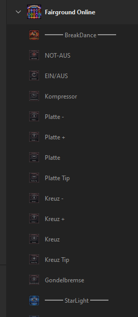

# Fairground Online – Stream Deck XL Plugin


Ein natives Stream Deck XL Plugin für [Fairground Online](https://store.steampowered.com/app/3310530/Fairground_Online/), das alle Fahrgeschäfte, Licht, Sound und Effekte direkt über den Stream Deck steuert.

**Inoffiziell erstellt von BlackMautz** – dieses Plugin ist kein offizielles Produkt des Spielentwicklers.


## Features

- **6 Fahrgeschäfte** komplett steuerbar: BreakDance, StarLight, XPlosion, FunHouse, Rotator, Turaka
- **Lichtsteuerung**: 9 Presets, 9 Einzellichter, Strobo, LED Strobe, Nebel, Flamme, Seifenblasen, Hupe
- **Spotlight**: AN/AUS, Farbstroboskop, Farbwechsel
- **Moving Heads**: AN/AUS, Licht, LightSync, Color Strobe, Farbe, Programm, Gobos
- **Sound & Mikrofon**: Play/Pause, Track-Wechsel, Mikrofon, Mikrofon-Echo
- **12 Jingles + 12 Decks**
- **Standard-Steuerung**: Ein-/Aussteigen, Kamerawechsel, Chat, Push to Talk, Sitzplatzwechsel
- **Settings**: Menü, Speed-Steuerung, Repeat Speed (3 Stufen), Schrift AN/AUS
- **8 vorkonfigurierte Seiten** mit übersichtlichem Button-Layout
- **157 Aktionen** in 12 Kategorien mit eigenen Kategorie-Icons
- **310+ individuelle Button-Icons** für jede Aktion
- **Toggle-Buttons** mit [AN]/[AUS] Statusanzeige
- **HoldToggle-Modus** (z.B. Mikrofon Echo: 1x drücken = an, nochmal drücken = aus)
- **Repeat-Modus** für alle Speed +/- Buttons mit 3 einstellbaren Geschwindigkeiten
- **Modifier-Unterstützung**: Shift und Ctrl Kombinationen wo vom Spiel gefordert
- **Schrift AN/AUS**: Alle Button-Titel global ein-/ausblenden
- **Auto-Updater**: Prüft beim Start auf neue Versionen auf GitHub


## Funktionsweise

Das Plugin wird komplett durch ein Python-Skript (`create_fairground_plugin.py`) generiert:

1. Generiert C# Quellcode für das native Stream Deck Plugin
2. Kompiliert mit dem .NET Framework 4.0 C# Compiler
3. Erstellt alle Icons, Kategorie-Bilder und Overlay-Bilder
4. Baut die manifest.json mit allen 157 Aktionen in 12 Kategorien
5. Erstellt ein eingebettetes Profil mit 8 Seiten und 166 Buttons
6. Verpackt alles als `.streamDeckPlugin` Installationspaket
7. Kopiert direkt in den installierten Plugin-Ordner und startet Stream Deck neu

Die Tasteneingaben werden über `keybd_event` mit Scan-Codes gesendet – das funktioniert unabhängig vom Tastaturlayout.

## Voraussetzungen

- Windows 10 oder höher
- [Elgato Stream Deck Software](https://www.elgato.com/downloads) (Version 5.0+)
- Stream Deck XL
- Python 3.x (zum Bauen des Plugins)
- .NET Framework 4.0 (in Windows enthalten)

## Installation

```bash
# Plugin bauen und installieren
python create_fairground_plugin.py
```

Das Skript erstellt `Fairground_Online.streamDeckPlugin`. Falls das Plugin bereits installiert ist, wird es direkt aktualisiert und Stream Deck neugestartet. Andernfalls: Doppelklick auf die `.streamDeckPlugin` Datei.

## Kategorien

| Kategorie | Aktionen |
|-----------|----------|
| BreakDance | NOT-AUS, EIN/AUS, Kompressor, Platte (Speed/AN/Tip), Kreuz (Speed/AN/Tip), Gondelbremse |
| StarLight | NOT-AUS, EIN/AUS, Reset, Parking, Gondel/Arm Pumpe, Gondola/Arm Speed+Bremse, Platform |
| XPlosion | NOT-AUS, EIN/AUS, Reset, Freigabe, Hoch/Runter, Null |
| FunHouse | NOT-AUS, EIN/AUS, 3 Drehscheiben, 2 Laufbänder, Vibrierplatte, Drehtunnel |
| Rotator | NOT-AUS, EIN/AUS, Reset, Park, Pumpe, Kompressor, Platte/Kreuz/Inverter, Bügel, Hub |
| Turaka | NOT-AUS, EIN/AUS, Reset, Speed, Richtung, Start/Stop, Platform, Park Wagen |
| Standard | Ein-/Aussteigen, Push to Talk, Sitzplatzwechsel, Kamerawechsel, Chat |
| LightEffect | 9 Presets, 9 Lights, Strobo, LED Strobe, Spot, Nebel, Flamme, Seifenblasen, Hupe |
| MovingHeads | AN/AUS, Licht, LightSync, Color Strobe, Farbe, Programm, Gobos |
| Sound | Play/Pause, Track-Wechsel, Mikrofon, Mikrofon Echo |
| Jingles | 12 Jingles + 12 Decks |
| Settings | Menü, Speed Hoch/Runter, Repeat Speed, Schrift AN/AUS |

## Seiten-Layout

| Seite | Inhalt |
|-------|--------|
| 1 | BreakDance |
| 2 | StarLight |
| 3 | XPlosion + FunHouse |
| 4 | Rotator |
| 5 | Turaka + Standard |
| 6 | LightEffect |
| 7 | MovingHeads + Sound |
| 8 | Jingles (1-12) + Decks (1-12) |



## Button-Modi

| Modus | Beschreibung |
|-------|-------------|
| Normal | Taste wird bei Druck kurz gesendet |
| Hold | Taste wird gehalten solange der Button gedrückt ist |
| Toggle | Erster Druck sendet AN-Taste, zweiter Druck sendet AUS-Taste |
| HoldToggle | Erster Druck hält Taste dauerhaft, zweiter Druck lässt los |
| Repeat | Taste wird wiederholt gedrückt solange der Button gehalten wird (einstellbare Geschwindigkeit) |
| Mod | Modifier (Shift/Ctrl) + Taste wird kurz gesendet |
| ModHold | Modifier + Taste wird gehalten |
| ModRepeat | Modifier + Taste wird wiederholt gedrückt |

## Repeat-Geschwindigkeiten

Über den "Repeat Speed" Button auf jeder Seite einstellbar:

| Stufe | Intervall | Tasten/Sek |
|-------|-----------|-----------|
| Langsam | 400ms | ~2 |
| Mittel | 200ms | ~4 |
| Schnell | 80ms | ~9 |

## Tasten-Referenz

Die Datei `fairground_input_actions.json` enthält die vollständige Tastenbelegung aus dem Spiel (extrahiert aus der Game-DLL).

## Lizenz

MIT License

## Autor

BlackMautz
