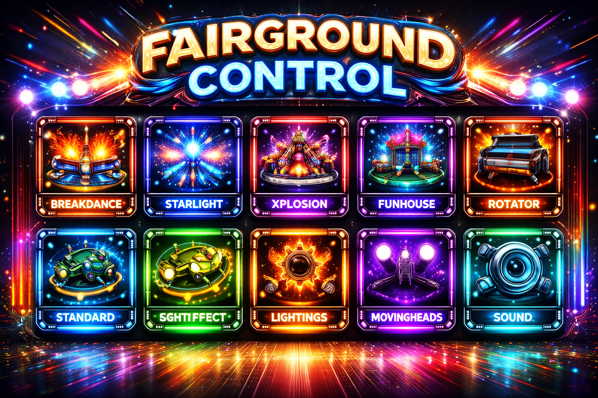
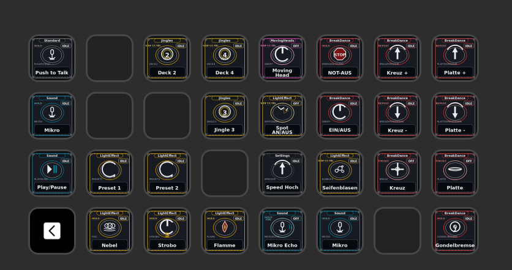

# Fairground Online  Stream Deck Plugin



Ein natives Stream Deck Plugin für [Fairground Online](https://store.steampowered.com/app/3310530/Fairground_Online/), das alle Fahrgeschäfte, Licht, Sound und Effekte direkt über den Stream Deck steuert. Funktioniert mit **allen Stream Deck Modellen** (MK.2, XL, Mini, Plus, etc.).

**Inoffiziell erstellt von BlackMautz**  dieses Plugin ist kein offizielles Produkt des Spielentwicklers.


## Features

- **6 Fahrgeschäfte** komplett steuerbar: BreakDance, StarLight, XPlosion, FunHouse, Rotator, Turaka
- **Sound2Light (S2L)**: Automatische Licht- und Fahrsteuerung die auf Musik reagiert  Echtzeit-FFT-Audioanalyse
- **AutoShow**: Komplett automatisierte Showabläufe mit vorprogrammierten Touren für BreakDance & Turaka
- **MegaDance-Programme**: 3 aufgezeichnete Showprogramme mit millisekundengenauem Timing
- **Lichtsteuerung**: 9 Presets, 9 Einzellichter, Strobo, LED Strobe, Nebel, Flamme, Seifenblasen, Hupe
- **Spotlight**: AN/AUS, Blackout/Flash, Farbwechsel bidirektional
- **Moving Heads**: AN/AUS, Licht, LightSync, Color Strobe, Farbe +/-, Programm +/-, Gobos +/-
- **Sound & Mikrofon**: Play/Pause, Track-Wechsel, Mikrofon, Mikrofon-Echo
- **12 Jingles + 12 Decks**
- **Timer**: Konfigurierbarer Countdown-Timer mit Property Inspector
- **Standard-Steuerung**: Ein-/Aussteigen, Kamerawechsel, Chat, Push to Talk, Sitzplatzwechsel
- **Settings**: Menü, Speed-Steuerung, Repeat Speed (3 Stufen), Schrift AN/AUS
- **165 Aktionen** in 13 Kategorien mit eigenen Kategorie-Icons
- **339 individuelle Button-Icons** für jede Aktion
- **Auto-Updater**: Prüft beim Start automatisch auf neue Versionen auf GitHub



## Sound2Light (S2L)  NEU in v2.0.0

Das Herzstück des Updates: **Sound2Light** analysiert in Echtzeit die Spielmusik und steuert automatisch Licht und Fahrgeschäft.

### Wie es funktioniert
- **Echtzeit-FFT** analysiert Bass (<200Hz), Mitten (200-2000Hz) und Höhen (>2000Hz) alle 20ms
- **Beat-Erkennung** triggert Effekte (Strobo, Nebel, Flamme) auf den Beat
- **Song-Stimmung** wird automatisch erkannt: Chill / Normal / Party
- **Song-Wechsel-Erkennung** resettet Durchschnitte bei Stille zwischen Songs
- **Adaptive Geschwindigkeit**: Platte & Kreuz passen sich der Musik-Energie an

### S2L Modi
| Modus | Beschreibung |
|-------|-------------|
| **Sound2Light** | Volle Steuerung: Fahrt + Licht + Effekte reagieren auf Musik |
| **S2L Licht** | Nur Licht & Effekte reagieren auf Musik (Fahrt manuell) |

### S2L Einstellungen (Property Inspector)
- **Sensitivity** (10-100): Empfindlichkeit der Audio-Analyse
- **Preset-Bereich**: Low (1-5) und High (5-9) für automatische Preset-Wahl
- **Effekt-Toggles**: Strobo, Nebel, Flamme, LED Strobe, ColorStrobe, Spot einzeln an/aus
- **9 Einzellicht-Toggles**: Jedes Licht einzeln aktivierbar
- **Nachtmodus**: Weniger hektische Effekte für ruhigere Atmosphäre
- **Loop/Endlos**: Automatische Wiederholung mit einstellbarer Pause (10-300s)
- **Gondel-Pause**: Automatisches Abbremsen in Intervallen
- **Show-Dauer**: 0 = endlos, oder 3/5/7/10 Minuten

### S2L Lichteffekte (Mood-abhängig)
| Effekt | Party | Normal | Chill |
|--------|-------|--------|-------|
| MH Programm | alle 8s | alle 12s | alle 18s |
| MH Farbe (+/-) | alle 5s | alle 8s | alle 12s |
| MH Gobo (+/-) | alle 6s | alle 10s | alle 15s |
| MH ColorStrobe | alle 6s | alle 10s | alle 15s |
| MH LightSync | 20s Cooldown | 20s Cooldown | 20s Cooldown |
| Spot Farbe | alle 3s | alle 5s | alle 8s |

## AutoShow  NEU in v2.0.0

Komplett automatisierte Shows per Knopfdruck.

### BreakDance AutoShow
- **5 Tour-Presets** (BD 1-5) mit vorprogrammierten Abläufen
- **AUTO DRIVE Modus**: Nur Fahrsteuerung ohne Licht/Effekte (zum manuellen Lichtfahren)
- **MegaDance** (Tour 6-9): 3 aufgezeichnete Profi-Programme mit:
  - Millisekundengenauem Timing für alle Aktionen
  - Gondelbremse-Sequenzen für dramatische Pausen
  - Richtungswechsel mit koordinierten Lichtmustern
  - MH Gobo/SpotColor-Rotation
  - Koordinierte FX-Mixes (Strobo + Flamme + Nebel)
- **Tour-Auswahl** über Property Inspector (inkl. Zufalls-Option)
- **Nachtmodus**: Shows auf 60% Dauer komprimiert
- **AutoLoop**: Dauerschleife mit einstellbarer Pause (30-180s)

### Turaka AutoShow  NEU
- **5 komplette Tour-Routinen** mit je 10 Phasen:
  - Fahrgäste einsteigen lassen
  - Platform hoch/runter
  - Bidirektionale Fahrprofile (Links/Rechts)
  - Richtungswechsel am Nullpunkt
  - Dynamische Effektauswahl (Strobo, Nebel, Flamme, Seifenblasen)
  - Preset-Cycling
  - Landung und Ausstieg

### P+K Tip  NEU
- **Toggle-Button** der gleichzeitiges Platte+Kreuz-Tippen aktiviert
- Hält beide Tipps synchron während der Show

## Kategorien

| Kategorie | Aktionen | Beschreibung |
|-----------|----------|-------------|
| BreakDance | 15 | NOT-AUS, EIN/AUS, Kompressor, Platte, Kreuz, Gondelbremse, P+K Tip, AutoShow, Auto Drive |
| StarLight | 16 | NOT-AUS, EIN/AUS, Reset, Parking, Gondel/Arm Pumpe, Speed, Bremse, Platform |
| XPlosion | 7 | NOT-AUS, EIN/AUS, Reset, Freigabe, Hoch/Runter, Null |
| FunHouse | 8 | NOT-AUS, EIN/AUS, 3 Drehscheiben, 2 Laufbänder, Vibrierplatte, Drehtunnel |
| Rotator | 21 | NOT-AUS, EIN/AUS, Reset, Park, Pumpe, Kompressor, Platte/Kreuz/Inverter, Bügel, Hub |
| Turaka | 13 | NOT-AUS, EIN/AUS, Reset, Speed, Richtung, Start/Stop, Platform, Park, AutoShow |
| Standard | 7 | Ein-/Aussteigen, Push to Talk, Sitzplatzwechsel, Kamerawechsel, Chat |
| LightEffect | 30 | 9 Presets, 9 Lights, Strobo, LED Strobe, Spot, Nebel, Flamme, Seifenblasen, Hupe |
| MovingHeads | 10 | AN/AUS, Licht, LightSync, Color Strobe, Farbe +/-, Programm +/-, Gobos +/- |
| Sound | 5 | Play/Pause, Track-Wechsel, Mikrofon, Mikrofon Echo |
| Timer | 1 | Konfigurierbarer Countdown-Timer |
| Jingles | 24 | 12 Jingles + 12 Decks |
| Settings | 8 | Menü, Speed, Repeat Speed, Schrift, Sound2Light, S2L Licht |

## Timer

- **Einstellbar**: Minuten und Sekunden über den Property Inspector
- **Kurz drücken**: Start/Pause
- **Lang gedrückt halten** (>800ms): Reset auf Startzeit
- **Blinkt 5x** wenn der Timer abgelaufen ist

## Button-Modi

| Modus | Beschreibung |
|-------|-------------|
| Normal | Taste wird bei Druck kurz gesendet |
| Hold | Taste wird gehalten solange der Button gedrückt ist |
| Toggle | Erster Druck sendet AN-Taste, zweiter Druck sendet AUS-Taste |
| HoldToggle | Erster Druck hält Taste dauerhaft, zweiter Druck lässt los |
| HoldMulti | Mehrere Tasten gleichzeitig gehalten (z.B. Strobo+Nebel+Flamme) |
| Repeat | Taste wird wiederholt gedrückt (einstellbare Geschwindigkeit) |
| Mod | Modifier (Shift/Ctrl) + Taste wird kurz gesendet |
| ModHold | Modifier + Taste wird gehalten |
| ModRepeat | Modifier + Taste wird wiederholt gedrückt |

## Repeat-Geschwindigkeiten

| Stufe | Intervall | Tasten/Sek |
|-------|-----------|-----------|
| Langsam | 400ms | ~2 |
| Mittel | 200ms | ~4 |
| Schnell | 80ms | ~9 |

## Funktionsweise

Das Plugin wird komplett durch ein Python-Skript (`create_fairground_plugin.py`) generiert:

1. Generiert C# Quellcode für das native Stream Deck Plugin
2. Kompiliert mit dem .NET Framework 4.0 C# Compiler
3. Erstellt alle Icons, Kategorie-Bilder und Overlay-Bilder
4. Baut die manifest.json mit allen 165 Aktionen in 13 Kategorien
5. Verpackt alles als `.streamDeckPlugin` Installationspaket
6. Kopiert direkt in den installierten Plugin-Ordner und startet Stream Deck neu

Die Tasteneingaben werden über `keybd_event` mit Scan-Codes gesendet  das funktioniert unabhängig vom Tastaturlayout.

## Voraussetzungen

- Windows 10 oder höher
- [Elgato Stream Deck Software](https://www.elgato.com/downloads) (Version 5.0+)
- Elgato Stream Deck (alle Modelle)
- Python 3.x + Pillow (nur zum Bauen des Plugins)
- .NET Framework 4.0 (in Windows enthalten)

## Installation

```bash
# Plugin bauen und installieren
python create_fairground_plugin.py
```

Das Skript erstellt `Fairground_Online.streamDeckPlugin`. Falls das Plugin bereits installiert ist, wird es direkt aktualisiert und Stream Deck neugestartet. Andernfalls: Doppelklick auf die `.streamDeckPlugin` Datei.

### Icons

Die Icons liegen im `icons/`-Ordner:
- `icons/categories/`  Kategorie-Icons + Plugin-Logo
- `icons/<ride>/`  Button-Icons pro Fahrgeschäft/Kategorie

## Tasten-Referenz

Die Datei `fairground_input_actions.json` enthält die vollständige Tastenbelegung aus dem Spiel (extrahiert aus der Game-DLL).

## Auto-Updater

Das Plugin prüft beim Start automatisch auf neue Versionen auf GitHub. Wenn ein Update verfügbar ist, wird es heruntergeladen und installiert  kein manuelles Update nötig.

## Lizenz

MIT License

## Changelog

### v2.0.0
- **Sound2Light (S2L)**: Komplett neues Echtzeit-Audio-Analyse-System
  - FFT-basierte Beat-Erkennung (Bass/Mitten/Höhen)
  - Automatische Song-Stimmung: Chill / Normal / Party
  - Song-Wechsel-Erkennung bei Stille
  - Adaptive Geschwindigkeit (Platte & Kreuz reagieren auf Musik)
  - Mood-abhängige Lichteffekte (MH Farbe, Gobo, Programm, Spot)
  - MH LightSync (Shift+C Toggle)
  - Konfigurierbarer Property Inspector (Sensitivity, Effekte, Nachtmodus, Loop)
- **S2L Licht**: Nur-Licht-Modus ohne Fahrsteuerung
- **AutoShow BreakDance**: 5 Tour-Presets + MegaDance-Programme
  - MegaDance: 3 aufgezeichnete Programme mit ms-genauen Sequenzen
  - AUTO DRIVE Modus (Fahrt ohne Licht)
  - Tour-Auswahl im Property Inspector
  - Nachtmodus (60% Dauer)
  - AutoLoop mit einstellbarer Pause
- **AutoShow Turaka**: 5 komplette Tour-Routinen (10 Phasen)
- **P+K Tip**: Toggle für gleichzeitiges Platte+Kreuz-Tippen
- **Moving Heads erweitert**: Farbe +/-, Gobo +/-, Programm +/- bidirektional
- **Spot erweitert**: Blackout/Flash, Farbwechsel bidirektional
- **HoldMulti-Modus**: Mehrere Tasten gleichzeitig halten
- **Safety-System**: Automatische Taste-Release bei Abbruch/Stop
- **165 Aktionen** (vorher 159), **339 Icons**

### v1.2.0
- AutoShow mit 5 Touren + Zufall, SHHoldMulti, Property Inspector

### v1.1.0
- Timer hinzugefügt mit Property Inspector
- Platte Tip & Kreuz Tip Fix
- Umlaute gefixt
- 159 Aktionen

### v1.0.5
- Universelle Stream Deck Unterstützung (alle Modelle)
- Profile entfernt

### v1.0.4
- Repeat-Beschleunigung (500-100ms)
- Game-Crash-Fix
- Vereinfachter Build

## Autor

Erstellt von **BlackMautz**